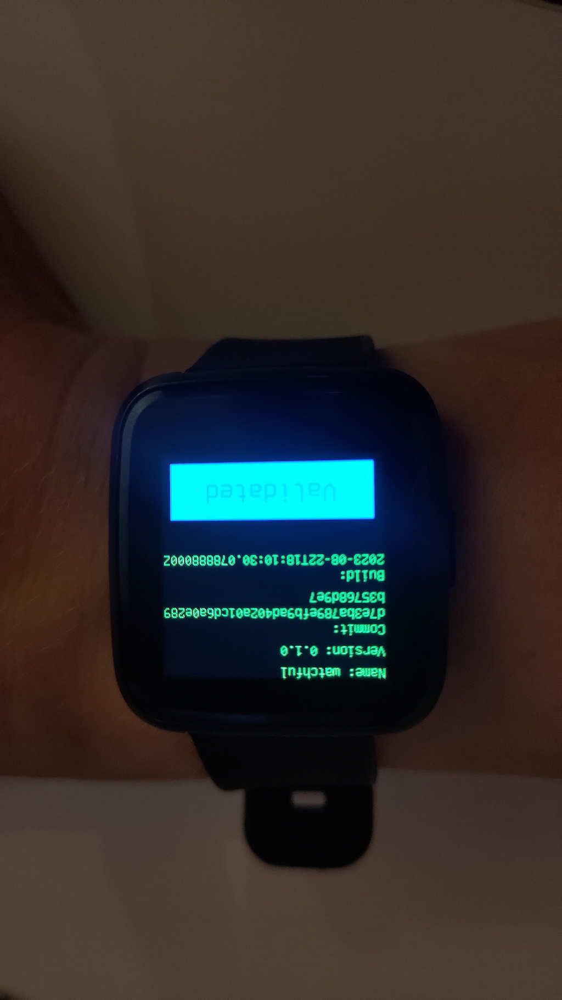

# Watchful

(Anagram for _ulfwatch_)

Real Time Async Enterprise Watch OS written in Rust!

Firmware for Pinetime based on [Embassy](https://embassy.dev).

TODO:

* [x] Implement Nordic DFU protocol (version supported by Gadgetbridge and SDK 15.x) (moved to [nrf-dfu-target](https://crates.io/crates/nrf-dfu-target) crate)
* [x] Synchronize watch with phone
* [x] Use external flash for firmware and persistence
* [x] Update firmware over DFU and validate in UI
* [x] Support installing from Infinitime 'factory firmware'
* [ ] Support swapping back to Inifinitime + MCUBoot
* [x] Show clock in view mode
* [x] View for viewing and validating firmware
* [ ] Low power in idle mode
* [ ] Menu for starting workout or finding phone
* [ ] Workout tracking mode
* [ ] Record and export of workout data
* [ ] Finding phone mode 
